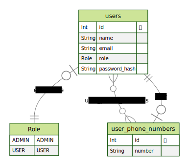

## Telephone Directory Server
### Agenda telefônica

### Tecnologias Utilizadas

- **Adonis.JS**
- **Prisma**
- **PostgreSQL**
- **Docker**

<p align="center">
  
</p>

### Regras de Negócio

#### 1. Acesso ao Sistema
Apenas usuários administradores têm permissão para utilizar o sistema.

#### 2. Gerenciamento de Usuários
Usuários administradores têm autorização para realizar as seguintes operações relacionadas a usuários:
- Visualizar informações de usuários
- Criar novos usuários
- Excluir usuários existentes
- Editar informações de usuários

#### 3. Gerenciamento de Listas de Números de Telefone
Usuários administradores têm permissão para gerenciar listas de números de telefone associadas a cada usuário, incluindo:
- Visualizar listas de números de telefone de usuários
- Criar novas listas de números de telefone
- Editar listas de números de telefone existentes

### Diagramas do Banco de Dados

<p align="center">
  
</p>

### Requisitos

- **Node.js:** Versão recomendada é a 20.12.2 (LTS).

### Instalação e Configuração

#### 1. Clone o repositório:
   ```bash
   git clone https://github.com/marcosdanielr/telephone-directory-server.git
   cd telephone-directory-server
```


#### 2. Instale as dependências:
```bash
npm install
```

#### 3. Certifique-se de ter o Docker instalado e execute:
```bash
docker compose up -d
```

#### 4. Aplique as migrações do Prisma:
```bash
npx prisma migrate dev
```

#### 5. Configure o arquivo prisma/seed.js e suba-os:
 Caso teste em ambiente de dev, pode deixar o JWT_SECRET em .env com o valor "any", e colocar este password_hash para algum usuário em prisma/seed.js ou cadastrar manualmente no banco de dados (```bash npx prisma studio```): "$bcrypt$v=98$r=10$uyJ9uessj6iOa84jw325pQ$oUGob15jVdCZhT8djf70c0u4wCOiyS4" (isto equivale a senha "123456789").
 Precisa disso, pois apenas usuários administradores podem cadastrar no sistema:

```bash
npx prisma db seed
```
Ou simplesmente em start/routes.ts, altere a linha 22 e cadastre o seu usuário na **role** **ADMIN** nesta rota:
```ts
router.post('api/users', [UsersController, 'create']).use(middleware.auth())
```

#### 6. Inicie a aplicação:
```bash
npm run dev
```

### Rotas

#### POST: /api/auth
- **Corpo da requisição:** 
```json
{ 
  "email": "example@example.com", 
  "password": "senha123" 
}
```
- **Descrição:** Rota de login.

#### GET: /api/users?page=1
- **Descrição:** Lista todos os usuários cadastrados.

#### POST: /api/users
- **Corpo da requisição:** 
```json
{ 
  "name": "Nome", 
  "email": "example@example.com", 
  "password": "senha123", 
  "role": "USER" 
}
```
- **Descrição:** Cria um novo usuário.

#### DELETE: /api/users/:id
- **Descrição:** Exclui um usuário pelo ID.

#### PATCH: /api/users/:id
- **Corpo da requisição:** 
```json
{ 
  "name": "Novo Nome", 
  "email": "novo@example.com", 
  "password": "novasenha123", 
  "role": "USER" 
}
```
- **Descrição:** Atualiza um usuário existente.

#### POST: /api/users/phone_numbers
- **Corpo da requisição:** 
```json
{ 
  "user_id": 1, 
  "number": "123456789" 
}
```
- **Descrição:** Cadastra um número de telefone para um usuário.

#### GET: /api/users/:user_id/phone_numbers
- **Descrição:** Lista os números de telefone de um usuário.

#### DELETE: /api/users/phone_numbers/:id
- **Descrição:** Exclui um número de telefone pelo ID.

#### PATCH: /api/users/phone_numbers/:id
- **Corpo da requisição:** 
```json
{ 
  "number": "987654321" 
}
```
- **Descrição:** Atualiza um número de telefone existente.

### Melhorias Futuras
- Criar documentação com Swagger.
- Separar as rotas em arquivos individuais.
- Adicionar rate limiter para evitar ataques.

